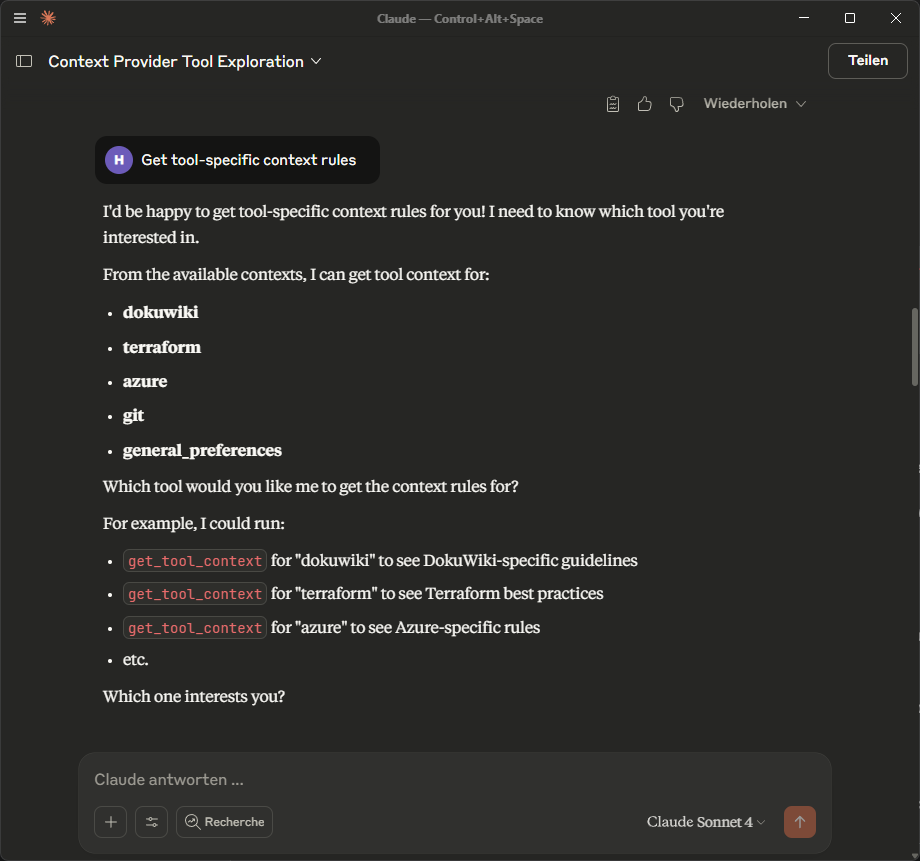

# MCP Context Provider

<div align="center">
  
  
  *The stable, glowing orb at the center represents the persistent context that survives across chat sessions. The flowing data streams show how ongoing conversations connect to and draw from this stable core of information, preventing context loss.*
</div>

A static MCP (Model Context Protocol) server that provides AI models with persistent tool context, preventing context loss between chat sessions. This server automatically loads and injects tool-specific rules, syntax preferences, and best practices at Claude Desktop startup.

## Overview

The Context Provider acts as a **persistent neural core** for your AI interactions, eliminating the need to re-establish context in each new chat session by:

- 🔄 **Persistent Context**: Like the stable orb in the visualization, rules and preferences survive across Claude Desktop restarts
- ⚡ **Automatic Injection**: Context flows seamlessly into every conversation, just as the data streams connect to the central core
- 🎯 **Tool-Specific**: Each tool gets its own context rules and syntax preferences, creating specialized knowledge pathways
- 🔧 **Auto-Corrections**: Automatic syntax transformations (e.g., Markdown → DokuWiki) ensure consistency across all interactions
- 📈 **Scalable**: Easy to add new tools and context rules, expanding the knowledge network
- 🏢 **Enterprise-Ready**: Version-controlled context management provides organizational stability

## The Neural Network Metaphor

Just like the image depicts, your MCP Context Provider functions as:
- **Central Orb**: The stable, persistent context core that maintains consistency
- **Neural Pathways**: Tool-specific context rules that create specialized knowledge channels  
- **Data Streams**: Individual chat sessions that flow through and benefit from the persistent context
- **Network Stability**: Prevents the ephemeral nature of conversations from losing important contextual information

## Quick Start

### Option 1: Automated Installation (Recommended)

The easiest way to install MCP Context Provider is using the provided installation scripts:

**Unix/Linux/macOS:**
```bash
# Download the DXT package
wget https://github.com/doobidoo/MCP-Context-Provider/raw/main/mcp-context-provider-1.2.1.dxt

# Run the installation script
curl -sSL https://raw.githubusercontent.com/doobidoo/MCP-Context-Provider/main/install.sh | bash
```

**Windows:**
```powershell
# Download and run the Windows installer
Invoke-WebRequest -Uri "https://raw.githubusercontent.com/doobidoo/MCP-Context-Provider/main/install.bat" -OutFile "install.bat"
.\install.bat
```

The installation script automatically:
- Unpacks the DXT extension
- Creates a Python virtual environment
- Installs all required dependencies
- Configures Claude Desktop settings

### Option 2: Manual Installation from DXT

```bash
# Install DXT CLI (if not already installed)
npm install -g @anthropic-ai/dxt

# Download the DXT package
wget https://github.com/doobidoo/MCP-Context-Provider/raw/main/mcp-context-provider-1.2.1.dxt

# Unpack the extension to your desired location
dxt unpack mcp-context-provider-1.2.1.dxt ~/mcp-context-provider

# Navigate to the installation directory
cd ~/mcp-context-provider

# Create and activate a Python virtual environment
python -m venv venv
source venv/bin/activate  # On Windows: venv\Scripts\activate

# Install dependencies
pip install mcp>=1.9.4
```

### Option 3: Installation from Source

```bash
# Clone the repository
git clone https://github.com/doobidoo/MCP-Context-Provider.git
cd MCP-Context-Provider

# Create and activate a Python virtual environment
python -m venv venv
source venv/bin/activate  # On Windows: venv\Scripts\activate

# Install dependencies
pip install -r requirements.txt
```

### 2. Configuration

Update your Claude Desktop configuration file:

**Configuration File Location**:
- **Linux**: `~/.config/claude/claude_desktop_config.json`
- **macOS**: `~/Library/Application Support/Claude/claude_desktop_config.json`
- **Windows**: `%APPDATA%\Claude\claude_desktop_config.json`

**For Virtual Environment Installation (Recommended):**
```json
{
  "mcpServers": {
    "context-provider": {
      "command": "/path/to/mcp-context-provider/venv/bin/python",
      "args": ["/path/to/mcp-context-provider/context_provider_server.py"],
      "env": {
        "CONTEXT_CONFIG_DIR": "/path/to/mcp-context-provider/contexts",
        "AUTO_LOAD_CONTEXTS": "true"
      }
    }
  }
}
```

**For System Python Installation:**
```json
{
  "mcpServers": {
    "context-provider": {
      "command": "python",
      "args": ["context_provider_server.py"],
      "cwd": "/path/to/MCP-Context-Provider",
      "env": {
        "CONTEXT_CONFIG_DIR": "./contexts",
        "AUTO_LOAD_CONTEXTS": "true"
      }
    }
  }
}
```

**Important**: Replace `/path/to/mcp-context-provider` with the actual installation path.

### 3. Verify Installation

Run the verification script to ensure everything is configured correctly:

```bash
python verify_install.py
```

### 4. Restart Claude Desktop

After updating the configuration, restart Claude Desktop to load the MCP server.

## How It Works

### Architecture

1. **Context Provider Server**: Python MCP server that loads JSON context files
2. **Context Files**: Tool-specific rules stored in `/contexts` directory  
3. **Claude Desktop Integration**: MCP server registered in configuration
4. **Automatic Loading**: Context is injected at startup and persists across chats

### Context Flow

```
Startup → Load Context Files → Register MCP Tools → Context Available in All Chats
```

### Available Tools

Once loaded, the following tools are available in all chat sessions:

- `get_tool_context`: Get context rules for specific tool
- `get_syntax_rules`: Get syntax conversion rules
- `list_available_contexts`: List all loaded context categories
- `apply_auto_corrections`: Apply automatic syntax corrections

<div align="center">
  
  
  *Screenshot showing the MCP Context Provider in action within Claude Desktop. The tool automatically detects and lists all available context categories (dokuwiki, terraform, azure, git, general_preferences) and provides interactive access to tool-specific rules and guidelines.*
</div>

## Context Files

The server loads context files from the `/contexts` directory:

- **`dokuwiki_context.json`**: DokuWiki syntax rules and preferences
- **`terraform_context.json`**: Terraform naming conventions and best practices
- **`azure_context.json`**: Azure resource naming and compliance rules
- **`git_context.json`**: Git commit conventions and workflow patterns
- **`general_preferences.json`**: Cross-tool preferences and standards

### Context File Structure

Each context file follows this pattern:

```json
{
  "tool_category": "toolname",
  "description": "Tool-specific context rules",
  "auto_convert": true,
  "syntax_rules": {
    "format_rules": "conversion patterns"
  },
  "preferences": {
    "user_preferences": "settings"
  },
  "auto_corrections": {
    "regex_patterns": "automatic fixes"
  },
  "metadata": {
    "version": "1.0.0",
    "applies_to_tools": ["tool:*"]
  }
}
```

## Examples

### DokuWiki Syntax Conversion

Input (Markdown):
```markdown
# My Header
This is `inline code` and here's a [link](http://example.com).
```

Auto-converted to DokuWiki:
```
====== My Header ======
This is ''inline code'' and here's a [[http://example.com|link]].
```

### Azure Resource Naming

Input: `storage_account_logs_prod`
Auto-corrected to: `stlogsprod` (following Azure naming conventions)

### Git Commit Messages

Input: `Fixed the login bug`
Auto-corrected to: `fix: resolve login authentication issue`

## Adding New Context

To add support for a new tool:

1. Create a new JSON file: `contexts/{toolname}_context.json`
2. Follow the standard context structure
3. Restart Claude Desktop to load the new context

The server automatically detects and loads any `*_context.json` files in the contexts directory.

## Benefits

### For Developers
- No need to re-establish context in new chats
- Automatic syntax corrections save time
- Consistent formatting across all work
- Best practices automatically applied

### For Teams
- Shared context rules across team members
- Version-controlled standards
- Consistent code and documentation formatting
- Enterprise compliance automatically enforced

### For Organizations
- Centralized context management
- Scalable across multiple tools
- Audit trail of context changes
- Easy deployment and updates

## Advanced Usage

### Custom Context Rules

Create your own context files by following the established pattern. The server supports:

- Regex-based auto-corrections
- Tool-specific preferences
- Conditional formatting rules
- Multi-tool context inheritance

### Environment-Specific Context

Use environment variables to load different context sets:

```json
{
  "env": {
    "CONTEXT_CONFIG_DIR": "./contexts/production",
    "ENVIRONMENT": "prod"
  }
}
```

## Troubleshooting

### Common Issues

1. **Context not loading**: Check file path in Claude Desktop config
2. **Server not starting**: Verify Python dependencies installed
3. **Rules not applying**: Check JSON syntax in context files

See [TROUBLESHOOTING.md](TROUBLESHOOTING.md) for detailed solutions.

## Documentation

- [Context Guide](CONTEXT_GUIDE.md): Complete context file reference
- [Developer Guide](DEVELOPER_GUIDE.md): Creating custom contexts
- [Examples](EXAMPLES.md): Real-world usage examples
- [Troubleshooting](TROUBLESHOOTING.md): Common issues and solutions

## DXT Package Distribution

The MCP Context Provider is available as a Desktop Extension (DXT) package for easy distribution and installation:

- **Package**: `mcp-context-provider-1.0.0.dxt` (18.6 MB)
- **Contents**: Complete server with all dependencies bundled
- **Platform**: Windows, macOS, Linux with Python 3.8+
- **Dependencies**: Self-contained (no external pip requirements)

### Building DXT Package

To build your own DXT package from source:

```bash
# Install DXT CLI
npm install -g @anthropic-ai/dxt

# Build the package
cd dxt
dxt pack

# The package will be created as mcp-context-provider-1.0.0.dxt
```

### Distribution Notes

- The DXT package includes all Python dependencies (MCP SDK, Pydantic, etc.)
- Total unpacked size: ~45 MB including all dependencies
- Optimized for offline installation and deployment
- Compatible with corporate environments and air-gapped systems

## Contributing

1. Fork the repository
2. Create a feature branch: `git checkout -b feature/new-context`
3. Add your context file to `/contexts`
4. Test with your Claude Desktop setup
5. Submit a pull request

## License

MIT License - see [LICENSE](LICENSE) file for details.
