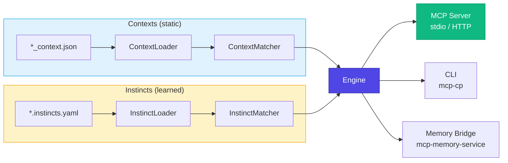
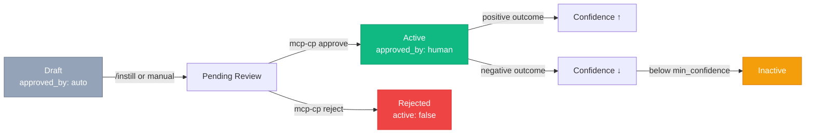

# Architecture

## Overview

The MCP Context Provider v2 is built around two core concepts that work together:



## Contexts

Contexts are **static, manually authored** JSON files that define tool-specific rules. They are always injected at full confidence (1.0).

### File format

Each context file follows the `*_context.json` naming convention and is automatically discovered:

```json
{
  "tool_category": "git",
  "description": "Git commit conventions and workflow patterns",
  "auto_convert": true,
  "metadata": {
    "version": "1.0.0",
    "priority": "high",
    "applies_to_tools": ["git:*", "bash:git"]
  },
  "syntax_rules": { ... },
  "preferences": { ... },
  "auto_corrections": { ... }
}
```

### Tool pattern matching

Contexts use glob-style patterns to determine which tools they apply to:

| Pattern | Matches |
|---------|---------|
| `*` | All tools |
| `git:*` | All git tools (`git:commit`, `git:push`, ...) |
| `bash:git` | Only `bash:git` (exact match) |
| `git` | Category-level: matches `git:commit`, `git:push`, etc. |

Contexts are sorted by priority (`high` > `medium` > `low`) when multiple match.

## Instincts

Instincts are **learned, confidence-scored** rules stored as YAML. They require human approval before activation.

### File format

```yaml
version: "1.0"
instincts:
  git-conventional-commits:
    id: git-conventional-commits
    rule: "Use conventional commit format: type(scope): description"
    domain: git
    tags: [commit, convention]
    trigger_patterns:
      - "git commit"
      - "commit message"
    confidence: 0.85
    min_confidence: 0.5
    active: true
    approved_by: human
    outcome_log:
      - timestamp: "2026-03-08T10:00:00Z"
        event: approved
        delta_confidence: 0.1
```

### Key properties

| Property | Description |
|----------|-------------|
| `confidence` | 0.0–1.0 score, adjusted by outcomes |
| `min_confidence` | Threshold below which the instinct won't fire |
| `approved_by` | Must be `human` for activation (`auto` = draft) |
| `trigger_patterns` | Regex patterns that trigger this instinct |
| `outcome_log` | Tracks every approval, rejection, and outcome event |

### Lifecycle



## Engine

The `Engine` class is the central coordinator. It loads both contexts and instincts, matches them against queries, and returns merged injection payloads.

### Injection flow

```typescript
const payload = engine.buildInjection('git:commit', 'writing a commit message');
// Returns:
// {
//   context_rules: [...],    // matched contexts (confidence: 1.0)
//   instinct_rules: [...],   // matched instincts (confidence: 0.0-1.0)
//   estimated_tokens: 450
// }
```

## Memory Bridge

The optional Memory Bridge syncs instincts bidirectionally with [mcp-memory-service](https://github.com/doobidoo/mcp-memory-service).

### Capabilities

- **Push/Pull Sync** — upsert instincts from YAML to memory and back
- **Orphan Detection** — find memories without corresponding YAML files
- **Semantic Discovery** — search for related instincts by meaning
- **Tagged Storage** — instincts stored with `instinct`, `instinct-id:<id>`, domain, and custom tags

### Configuration

```typescript
const engine = new Engine({
  contextsPath: './contexts',
  instinctsPath: './instincts',
  memoryBridge: {
    baseUrl: 'http://127.0.0.1:8000/api',
    apiKey: process.env.MCP_API_KEY,
    enabled: true,
  },
});
```

## Project Structure

```
src/
  server/             MCP server (stdio + HTTP transport)
    index.ts          Entry point
    tools.ts          13 MCP tool registrations
    env.ts            Environment config
  engine/             Core engines
    engine.ts         Unified Engine coordinator
    context-loader.ts JSON discovery + validation
    context-matcher.ts Tool-pattern matching
    instinct-loader.ts YAML load/save
    instinct-matcher.ts Regex trigger matching
  bridge/             Memory Bridge
    http-bridge.ts    HTTP implementation
    sync.ts           YAML ↔ Memory sync
    types.ts          Interface + config
  cli/                Approval Registry CLI
    index.ts          CLI entry point
    registry.ts       Lifecycle operations
    formatter.ts      ANSI formatting
  schema/             Zod validation schemas
  types/              TypeScript type definitions

contexts/             JSON context files (*_context.json)
instincts/            YAML instinct files (*.instincts.yaml)
```
