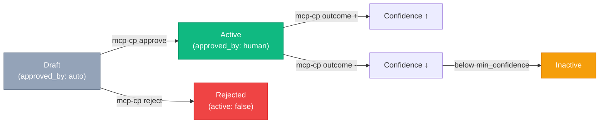

# CLI Reference — `mcp-cp`

The `mcp-cp` command-line tool manages the instinct approval registry. It reads and writes YAML instinct files directly on disk.

## Installation

After building the project, `mcp-cp` is available as a bin entry:

```bash
npm run build
npx mcp-cp --help
```

Or link it globally:

```bash
npm link
mcp-cp --help
```

## Global Options

| Option | Description |
|--------|-------------|
| `--path <dir>` | Instincts directory (default: `./instincts`) |
| `--help` | Show help |

## Commands

### `list` / `ls`

List all instincts across all YAML files with a summary table.

```bash
mcp-cp list
mcp-cp list --path /custom/instincts
```

Shows each instinct's ID, domain, confidence score, active status, and approval state.

---

### `show <id>` / `inspect <id>`

Show detailed information about a specific instinct.

```bash
mcp-cp show git-conventional-commits
```

Displays the full instinct definition including rule text, trigger patterns, tags, confidence history, and outcome log.

---

### `approve <id>`

Approve an instinct for active use. This sets `approved_by` to `human` and activates the instinct.

```bash
mcp-cp approve git-conventional-commits
```

!!! important
    Instincts extracted by `/instill` start as drafts (`approved_by: auto`). They must be explicitly approved before they fire during sessions.

---

### `reject <id>`

Reject an instinct. Deactivates it and reduces confidence by 0.3.

```bash
mcp-cp reject noisy-instinct
```

The rejection is recorded in the instinct's `outcome_log`.

---

### `tune <id> [options]`

Tune an instinct's parameters without fully approving or rejecting it.

```bash
# Adjust confidence
mcp-cp tune git-conventional --confidence 0.9

# Update the rule text
mcp-cp tune git-conventional --rule "Always use type(scope): description format"

# Set minimum confidence threshold
mcp-cp tune git-conventional --min-confidence 0.6

# Activate or deactivate
mcp-cp tune git-conventional --active false

# Update tags
mcp-cp tune git-conventional --tags "git,commit,convention"

# Update trigger patterns
mcp-cp tune git-conventional --triggers "git commit,commit message,writing commit"
```

| Option | Description |
|--------|-------------|
| `--confidence <0.0-1.0>` | Set confidence score |
| `--min-confidence <0.0-1.0>` | Set minimum threshold (instinct deactivates below this) |
| `--rule "text"` | Update the rule text |
| `--active true\|false` | Activate or deactivate |
| `--tags "a,b,c"` | Set tags (comma-separated) |
| `--triggers "p1,p2"` | Set trigger patterns (comma-separated) |

---

### `outcome <id> <+|-|~> [note]`

Record an outcome event for an instinct, adjusting its confidence.

```bash
# Positive outcome (+0.05 confidence)
mcp-cp outcome git-conventional + "Helped write better commits"

# Negative outcome (-0.10 confidence)
mcp-cp outcome git-conventional - "Too strict for quick fixes"

# Neutral outcome (no change)
mcp-cp outcome git-conventional ~ "Used but no clear impact"
```

| Symbol | Result | Confidence Delta |
|--------|--------|-----------------|
| `+` | positive | +0.05 |
| `-` | negative | -0.10 |
| `~` | neutral | 0.00 |

Outcomes are logged in the instinct's `outcome_log` with a timestamp.

---

### `remove <id>` / `rm <id>`

Permanently delete an instinct from its YAML file.

```bash
mcp-cp remove obsolete-instinct
```

!!! warning
    This operation is permanent. The instinct is removed from the YAML file on disk.

---

## Instinct Lifecycle



## Typical Workflow

1. **Extract** instincts from a session using `/instill` in Claude Code
2. **Review** with `mcp-cp list` to see all pending drafts
3. **Inspect** each with `mcp-cp show <id>`
4. **Approve** good instincts: `mcp-cp approve <id>`
5. **Reject** unwanted ones: `mcp-cp reject <id>`
6. **Tune** as needed: adjust confidence, triggers, or rule text
7. **Record outcomes** over time to refine confidence scores

## Examples

```bash
# See what instincts are available
mcp-cp list

# Inspect a specific instinct
mcp-cp show test-before-push

# Approve it for use
mcp-cp approve test-before-push

# Later, record that it helped
mcp-cp outcome test-before-push + "Caught a bug before pushing"

# Boost its confidence
mcp-cp tune test-before-push --confidence 0.95
```
