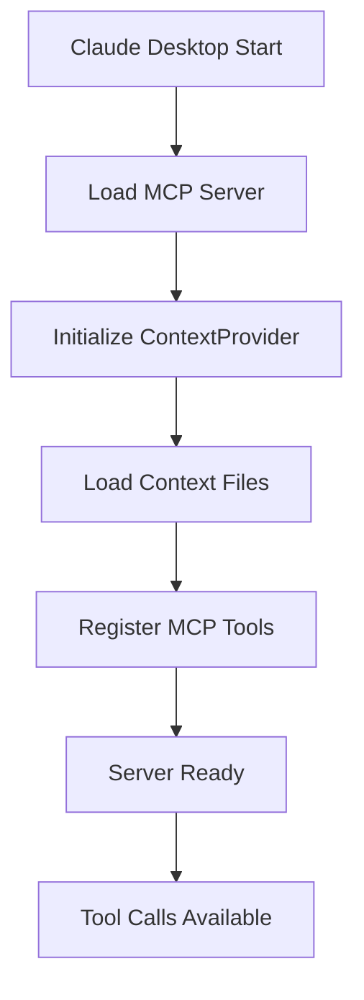

# Developer Guide

Comprehensive guide for developing, extending, and customizing the MCP Context Provider.

## Table of Contents

- [Development Setup](#development-setup)
- [Server Architecture](#server-architecture)
- [Creating Custom Contexts](#creating-custom-contexts)
- [Extending the Server](#extending-the-server)
- [Testing](#testing)
- [Debugging](#debugging)
- [Deployment](#deployment)
- [API Reference](#api-reference)

## Development Setup

### Prerequisites

- Python 3.8+
- Claude Desktop
- Basic understanding of MCP (Model Context Protocol)
- JSON and regex knowledge

### Installation

1. **Clone and setup**:
   ```bash
   git clone https://github.com/your-repo/MCP-Context-Provider.git
   cd MCP-Context-Provider
   python -m venv venv
   source venv/bin/activate  # or venv\Scripts\activate on Windows
   pip install mcp
   ```

2. **Development dependencies**:
   ```bash
   pip install pytest black flake8 mypy
   ```

3. **IDE Setup**:
   - Install Python extension
   - Configure linting and formatting
   - Set up debugging for Python scripts

## Server Architecture

### Core Components

```
MCP-Context-Provider/
├── context_provider_server.py     # Main MCP server
├── contexts/                      # Context files directory
│   ├── dokuwiki_context.json
│   ├── terraform_context.json
│   └── ...
├── claude_desktop_config_with_context.json
└── docs/
```

### Class Structure

```python
class ContextProvider:
    def __init__(self, config_dir: str)
    def load_all_contexts(self)
    def load_context_file(self, file_path: Path)
    def get_tool_context(self, tool_name: str)
    def get_syntax_rules(self, tool_name: str)
    def get_preferences(self, tool_name: str)
    def apply_auto_corrections(self, tool_name: str, text: str)
```

### MCP Server Flow



### Tool Registration

The server registers four main tools:

1. **get_tool_context**: Returns full context for a tool
2. **get_syntax_rules**: Returns syntax rules only
3. **list_available_contexts**: Lists all loaded contexts
4. **apply_auto_corrections**: Applies regex corrections to text

## Creating Custom Contexts

### Step-by-Step Process

#### 1. Identify Tool Requirements

Analyze the target tool to identify:
- Common syntax patterns
- Formatting preferences
- Naming conventions
- Best practices
- Common mistakes to auto-correct

#### 2. Create Context File

Create `contexts/{toolname}_context.json`:

```json
{
  "tool_category": "my_tool",
  "description": "Context rules for my custom tool",
  "auto_convert": true,
  "syntax_rules": {
    // Define formatting rules
  },
  "preferences": {
    // Define user preferences
  },
  "auto_corrections": {
    // Define regex corrections
  },
  "metadata": {
    "version": "1.0.0",
    "last_updated": "2025-01-08",
    "applies_to_tools": ["my_tool:*"]
  }
}
```

#### 3. Define Syntax Rules

Structure syntax rules logically:

```json
{
  "syntax_rules": {
    "formatting": {
      "indent": "  ",
      "line_ending": "\\n",
      "quote_style": "double"
    },
    "naming": {
      "variables": "camelCase",
      "functions": "camelCase",
      "classes": "PascalCase",
      "constants": "UPPER_SNAKE_CASE"
    },
    "patterns": {
      "function_definition": "function {}() {\\n  // body\\n}",
      "class_definition": "class {} {\\n  constructor() {\\n    // initialization\\n  }\\n}"
    }
  }
}
```

#### 4. Add Auto-Corrections

Create regex patterns for common corrections:

```json
{
  "auto_corrections": {
    "fix_spacing": {
      "pattern": "\\s{2,}",
      "replacement": " "
    },
    "standardize_quotes": {
      "pattern": "'([^']*)'",
      "replacement": "\"$1\""
    },
    "fix_semicolons": {
      "pattern": "([^;])\\n",
      "replacement": "$1;\\n"
    }
  }
}
```

#### 5. Test the Context

```python
# Test script: test_context.py
from context_provider_server import ContextProvider

def test_my_context():
    provider = ContextProvider()
    
    # Test context loading
    context = provider.get_tool_context("my_tool")
    assert context["tool_category"] == "my_tool"
    
    # Test auto-corrections
    input_text = "let  x='hello'"
    corrected = provider.apply_auto_corrections("my_tool", input_text)
    expected = "let x=\"hello\";"
    assert corrected == expected
    
    print("All tests passed!")

if __name__ == "__main__":
    test_my_context()
```

### Advanced Context Patterns

#### Conditional Rules

```json
{
  "syntax_rules": {
    "environment_specific": {
      "development": {
        "debug_enabled": true,
        "logging_level": "debug"
      },
      "production": {
        "debug_enabled": false,
        "logging_level": "error"
      }
    }
  }
}
```

#### Hierarchical Preferences

```json
{
  "preferences": {
    "global": {
      "encoding": "utf-8",
      "line_endings": "lf"
    },
    "project_specific": {
      "web": {
        "framework": "react",
        "build_tool": "vite"
      },
      "api": {
        "framework": "fastapi",
        "database": "postgresql"
      }
    }
  }
}
```

#### Multi-Language Support

```json
{
  "syntax_rules": {
    "languages": {
      "javascript": {
        "file_extension": ".js",
        "comment_style": "// {}",
        "block_comment": "/* {} */"
      },
      "typescript": {
        "file_extension": ".ts",
        "comment_style": "// {}",
        "type_annotations": true
      }
    }
  }
}
```

## Extending the Server

### Adding New MCP Tools

1. **Define the tool**:

```python
Tool(
    name="my_custom_tool",
    description="Description of what the tool does",
    inputSchema={
        "type": "object",
        "properties": {
            "param1": {
                "type": "string",
                "description": "First parameter"
            }
        },
        "required": ["param1"]
    }
)
```

2. **Implement the handler**:

```python
@app.call_tool()
async def handle_call_tool(name: str, arguments: dict) -> CallToolResult:
    if name == "my_custom_tool":
        param1 = arguments.get("param1")
        
        # Your custom logic here
        result = process_custom_logic(param1)
        
        return CallToolResult(
            content=[TextContent(type="text", text=str(result))]
        )
```

### Adding Context Validation

```python
def validate_context_file(file_path: Path) -> bool:
    """Validate context file structure and content"""
    try:
        with open(file_path, 'r') as f:
            context = json.load(f)
        
        # Required fields
        required_fields = ['tool_category', 'description']
        for field in required_fields:
            if field not in context:
                print(f"Missing required field: {field}")
                return False
        
        # Validate auto_corrections regex patterns
        auto_corrections = context.get('auto_corrections', {})
        for name, rule in auto_corrections.items():
            if 'pattern' in rule:
                try:
                    re.compile(rule['pattern'])
                except re.error as e:
                    print(f"Invalid regex pattern in {name}: {e}")
                    return False
        
        return True
        
    except Exception as e:
        print(f"Error validating context file: {e}")
        return False
```

### Custom Context Loaders

```python
class CustomContextLoader:
    def load_from_database(self, connection_string: str):
        """Load contexts from database"""
        pass
    
    def load_from_api(self, api_endpoint: str):
        """Load contexts from API"""
        pass
    
    def load_from_git(self, repo_url: str, branch: str = "main"):
        """Load contexts from Git repository"""
        pass
```

## Testing

### Unit Tests

```python
# tests/test_context_provider.py
import pytest
from context_provider_server import ContextProvider

class TestContextProvider:
    def setup_method(self):
        self.provider = ContextProvider("./test_contexts")
    
    def test_load_contexts(self):
        assert len(self.provider.contexts) > 0
    
    def test_get_tool_context(self):
        context = self.provider.get_tool_context("dokuwiki")
        assert context["tool_category"] == "dokuwiki"
    
    def test_apply_auto_corrections(self):
        input_text = "# Header"
        result = self.provider.apply_auto_corrections("dokuwiki", input_text)
        assert "======" in result
```

### Integration Tests

```python
# tests/test_integration.py
import asyncio
import json
from context_provider_server import app

async def test_mcp_tools():
    """Test MCP tool integration"""
    
    # Test list_tools
    tools = await app.list_tools()
    assert len(tools) >= 4
    
    # Test tool calls
    result = await app.call_tool("list_available_contexts", {})
    contexts = json.loads(result.content[0].text)
    assert isinstance(contexts, list)
```

### Performance Tests

```python
import time
from context_provider_server import ContextProvider

def test_context_loading_performance():
    """Test context loading performance"""
    start_time = time.time()
    provider = ContextProvider()
    load_time = time.time() - start_time
    
    assert load_time < 1.0, f"Context loading took {load_time:.2f}s"
    
def test_regex_performance():
    """Test auto-correction regex performance"""
    provider = ContextProvider()
    large_text = "Sample text " * 1000
    
    start_time = time.time()
    result = provider.apply_auto_corrections("dokuwiki", large_text)
    correction_time = time.time() - start_time
    
    assert correction_time < 0.1, f"Auto-corrections took {correction_time:.2f}s"
```

## Debugging

### Enable Debug Mode

1. **Environment variable**:
   ```bash
   export DEBUG_MODE=true
   ```

2. **Claude Desktop config**:
   ```json
   {
     "env": {
       "DEBUG_MODE": "true"
     }
   }
   ```

### Logging

Add logging to the server:

```python
import logging

# Configure logging
logging.basicConfig(
    level=logging.DEBUG if os.getenv('DEBUG_MODE') == 'true' else logging.INFO,
    format='%(asctime)s - %(name)s - %(levelname)s - %(message)s'
)

logger = logging.getLogger(__name__)

class ContextProvider:
    def load_context_file(self, file_path: Path):
        logger.debug(f"Loading context file: {file_path}")
        # ... rest of method
```

### Common Debug Scenarios

1. **Context not loading**:
   ```python
   def debug_context_loading():
       provider = ContextProvider()
       print(f"Loaded contexts: {list(provider.contexts.keys())}")
       for name, context in provider.contexts.items():
           print(f"  {name}: {context.get('description', 'No description')}")
   ```

2. **Regex not working**:
   ```python
   def debug_regex_patterns(tool_name: str, text: str):
       provider = ContextProvider()
       context = provider.get_tool_context(tool_name)
       auto_corrections = context.get('auto_corrections', {})
       
       for name, rule in auto_corrections.items():
           pattern = rule['pattern']
           replacement = rule['replacement']
           
           import re
           matches = re.findall(pattern, text)
           if matches:
               print(f"Rule '{name}' matched: {matches}")
           else:
               print(f"Rule '{name}' no matches")
   ```

### Remote Debugging

For Claude Desktop integration debugging:

```python
# Add to server startup
if os.getenv('DEBUG_MODE') == 'true':
    import pdb
    pdb.set_trace()  # Breaks execution for debugging
```

## Deployment

### Development Deployment

1. **Local testing**:
   ```bash
   python context_provider_server.py
   # Test with sample MCP calls
   ```

2. **Claude Desktop integration**:
   - Update configuration file
   - Restart Claude Desktop
   - Test context loading

### Production Deployment

1. **Package preparation**:
   ```bash
   # Create requirements.txt
   pip freeze > requirements.txt
   
   # Create setup script
   python setup.py sdist bdist_wheel
   ```

2. **Distribution**:
   ```bash
   # Create distribution package
   zip -r mcp-context-provider.zip . -x "*.git*" "*__pycache__*"
   ```

3. **Installation script**:
   ```bash
   #!/bin/bash
   # install.sh
   
   python -m venv venv
   source venv/bin/activate
   pip install -r requirements.txt
   
   echo "Installation complete!"
   echo "Update your Claude Desktop config with:"
   echo "  \"cwd\": \"$(pwd)\""
   ```

### Configuration Management

For multiple environments:

```python
# config.py
import os

class Config:
    CONTEXT_DIR = os.getenv('CONTEXT_CONFIG_DIR', './contexts')
    DEBUG_MODE = os.getenv('DEBUG_MODE', 'false').lower() == 'true'
    AUTO_LOAD = os.getenv('AUTO_LOAD_CONTEXTS', 'true').lower() == 'true'

class DevelopmentConfig(Config):
    DEBUG_MODE = True
    CONTEXT_DIR = './contexts/development'

class ProductionConfig(Config):
    DEBUG_MODE = False
    CONTEXT_DIR = './contexts/production'
```

## API Reference

### ContextProvider Class

#### Methods

- `__init__(config_dir: str = "./contexts")`: Initialize with context directory
- `load_all_contexts()`: Load all context files from directory
- `get_tool_context(tool_name: str) -> Dict[str, Any]`: Get full context for tool
- `get_syntax_rules(tool_name: str) -> Dict[str, Any]`: Get syntax rules only
- `get_preferences(tool_name: str) -> Dict[str, Any]`: Get preferences only
- `apply_auto_corrections(tool_name: str, text: str) -> str`: Apply corrections to text

### MCP Tools

#### get_tool_context
- **Input**: `{"tool_name": "string"}`
- **Output**: Complete context object as JSON
- **Usage**: Get all rules and preferences for a tool

#### get_syntax_rules
- **Input**: `{"tool_name": "string"}`
- **Output**: Syntax rules object as JSON
- **Usage**: Get formatting and conversion rules

#### list_available_contexts
- **Input**: `{}`
- **Output**: Array of context category names
- **Usage**: Discover available contexts

#### apply_auto_corrections
- **Input**: `{"tool_name": "string", "text": "string"}`
- **Output**: Corrected text
- **Usage**: Apply regex-based corrections

### Error Handling

All MCP tools return errors in this format:

```json
{
  "content": [{"type": "text", "text": "Error: description"}],
  "isError": true
}
```

Common error scenarios:
- Missing tool_name parameter
- Tool context not found
- Invalid regex patterns
- File loading errors

This completes the comprehensive developer guide for the MCP Context Provider.