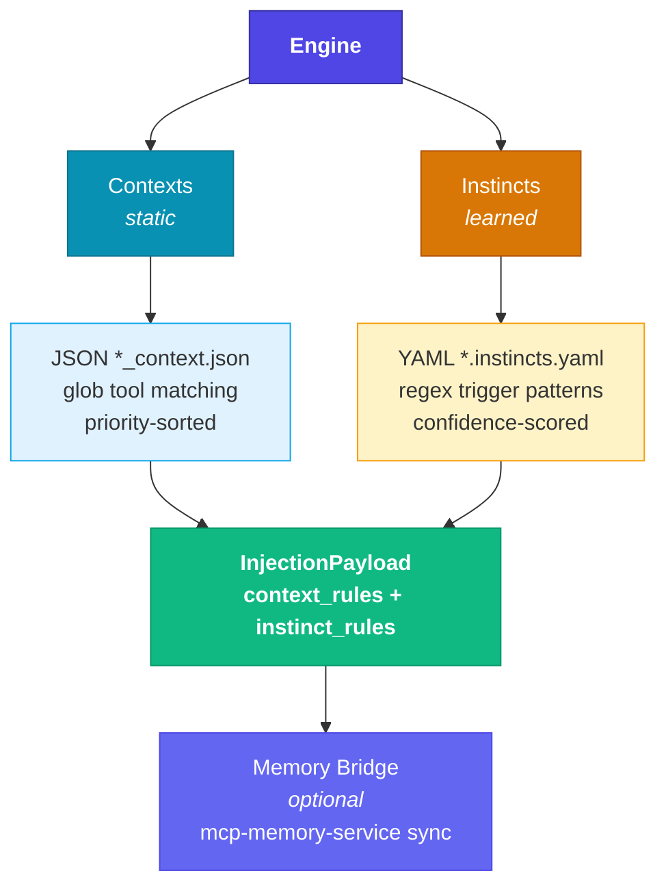

# MCP Context Provider v2

<div align="center">
  
</div>

> **Persistent context and learned instincts for Claude Code** — static rules meet confidence-scored intelligence.

The MCP Context Provider delivers two complementary systems:

- **Contexts** (static) — Manually authored tool-specific rules (200–1000 tokens), always injected at full confidence
- **Instincts** (learned) — Distilled from sessions, confidence-scored (0.0–1.0), human-approved before activation

## What's new in v2

v2 is a **complete TypeScript rewrite** from the Python v1.x codebase. Key changes:

| | v1.x (Python) | v2.x (TypeScript) |
|---|---|---|
| Runtime | Python MCP server | Node.js MCP server |
| Rules | Static JSON contexts only | JSON contexts + YAML instincts |
| Learning | Phase 1/2/3 system | Instinct Engine with confidence scoring |
| Transport | stdio only | stdio (default) + Streamable HTTP |
| CLI | None | `mcp-cp` approval registry |
| Memory | Simulated integration | Real mcp-memory-service bridge |

## Quick Start

```bash
git clone https://github.com/doobidoo/MCP-Context-Provider.git
cd MCP-Context-Provider
npm install && npm run build
```

Add to your `.mcp.json`:

```json
{
  "mcpServers": {
    "context-provider": {
      "command": "node",
      "args": ["dist/server/index.js"],
      "cwd": "/path/to/MCP-Context-Provider",
      "env": {
        "CONTEXTS_PATH": "./contexts",
        "INSTINCTS_PATH": "./instincts"
      }
    }
  }
}
```

Restart Claude Code. See [Getting Started](getting-started.md) for full instructions.

## Architecture



## Three Subsystems

| Subsystem | Purpose |
|-----------|---------|
| **Engine** | Loads, matches, and merges contexts + instincts into injection payloads |
| **CLI** (`mcp-cp`) | Approval registry for instinct lifecycle management |
| **Memory Bridge** | Syncs instincts to mcp-memory-service via HTTP API |

## Available Contexts (built-in)

| Context | What it does |
|---------|-------------|
| `dokuwiki` | Markdown → DokuWiki syntax conversion |
| `azure` | Azure resource naming conventions and compliance |
| `terraform` | Terraform snake_case, module patterns, state management |
| `git` | Conventional commits, branch naming |
| `general_preferences` | Cross-tool preferences and workflow standards |
| `applescript` | AppleScript patterns and best practices |
| `memory` | MCP Memory Service auto-store/retrieve triggers |
| `date_awareness` | Temporal context and scheduling awareness |

## Version

Current release: **v2.0.0**

## License

Apache License 2.0 — see [LICENSE](https://github.com/doobidoo/MCP-Context-Provider/blob/main/LICENSE)
